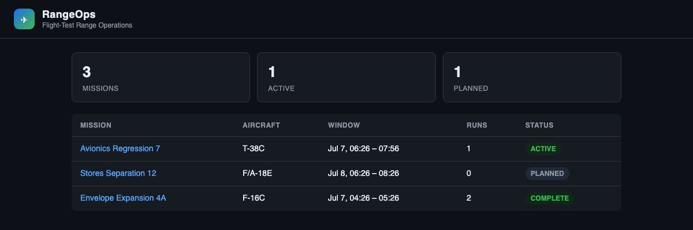
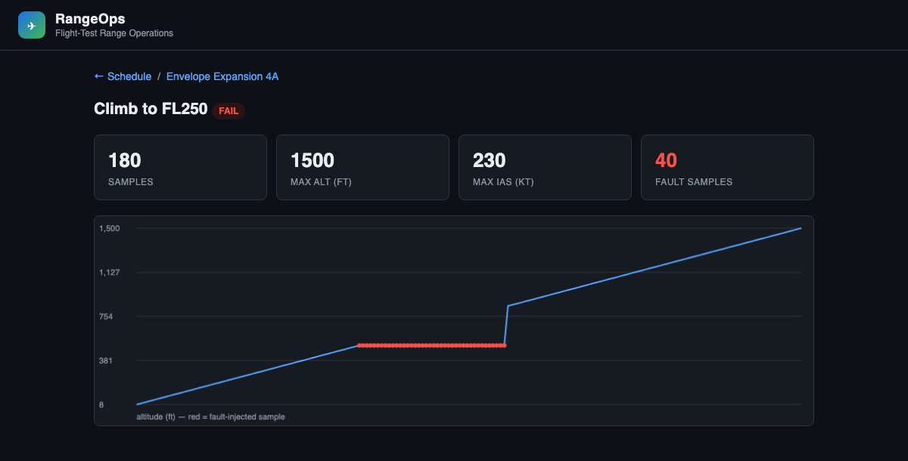

# RangeOps — Flight-Test Range Operations Suite

[](https://github.com/connorkoch0511/RangeOps/actions/workflows/ci.yml)

**Live dashboard → https://rangeops-dashboard.vercel.app**

A multi-language operations suite modeled on how a real flight-test range runs:
a low-level **C** instrumentation program, a **C# / .NET** desktop operator
console, and a **Python / Django** web dashboard — all integrating through
**one shared PostgreSQL schema**.

It's deliberately built the way range software actually exists in the field:
different eras and languages coexisting, held together by a common database
contract rather than a single monolith.

## Screenshots

The web dashboard — schedule board, mission detail, and a live telemetry report.
(The screenshots below are produced by the [E2E test suite](dashboard/e2e/), so
they never drift from what the app renders.)

**Schedule board** — every mission with a status rollup:



**Telemetry report** — captured samples, a fault summary, and a chart where the
flat **red** segment is the injected stuck-altimeter fault (altitude frozen while
the aircraft keeps climbing), which is why the run is marked **FAIL**:



## Architecture

```
┌──────────────────┐   telemetry over TCP    ┌───────────────────────────────┐
│  sensor-sim      │ ──────────────────────▶ │  Operator Console             │
│  C program       │   altitude / airspeed / │  C# · .NET · Avalonia (XAML)  │
│  "the rig"       │   vertical speed @ 5 Hz  │  · schedule test missions     │
└──────────────────┘   + injectable faults    │  · watch live telemetry       │
                                               │  · persist via EF Core ──┐    │
                                               └──────────────────────────┼────┘
                                                                          │
                                                              ┌───────────▼────────────┐
                                                              │  PostgreSQL             │
                                                              │  missions · test_runs · │
                                                              │  telemetry_samples      │
                                                              └───────────▲────────────┘
                                                                          │ Django ORM
                                               ┌──────────────────────────┼────┐
                                               │  Web Dashboard            │    │
                                               │  Python · Django          │    │
                                               │  HTML / CSS / JS          │    │
                                               │  · read-only schedule &   │    │
                                               │    telemetry reporting    │    │
                                               └────────────────────────────────┘
```

### Why it's built this way

- **One schema, two ORMs (database-first).** `db/schema.sql` is the source of
  truth. Neither the C# EF Core context nor the Django models own migrations —
  both map to the existing tables. This mirrors real integration work where a
  shared operational database is the contract between systems.
- **Separation of concerns.** The C program does one thing (emit telemetry);
  the desktop app is the operator's control surface; the web app is read-only
  reporting for people without the desktop tool installed.
- **Testability through seams.** Capture logic lives behind an
  `ITelemetrySource` interface, so the same pipeline runs in the GUI, the
  headless CLI, and the tests.

## Components

| Dir | Stack | Role |
|-----|-------|------|
| [`sensor-sim/`](sensor-sim/) | **C** (POSIX sockets) | Simulated instrumentation rig streaming telemetry over TCP, with injectable sensor faults |
| [`console/`](console/) | **C# · .NET 8 · Avalonia · EF Core** | Operator console (`RangeOps.Console`), shared logic (`RangeOps.Core`), a headless capture CLI (`RangeOps.Capture`), and xUnit tests (`RangeOps.Tests`) |
| [`dashboard/`](dashboard/) | **Python · Django · HTML/CSS/JS** | Web dashboard (schedule & telemetry reporting via the Django ORM) + [Playwright E2E tests](dashboard/e2e/) |
| [`db/`](db/) | **SQL (PostgreSQL 16)** | Shared schema + seed data |

## Testing

Every layer is tested, and it all runs in [CI](.github/workflows/ci.yml) on each push:

| Level | Tooling | What it covers |
|-------|---------|----------------|
| **Unit** | xUnit, pytest | Telemetry parsing, view logic, model behavior |
| **Integration** | xUnit + Postgres, pytest + Postgres | EF Core & Django ORM against the real shared schema |
| **System** | [`scripts/system-test.sh`](scripts/system-test.sh) | The full pipeline: C sim → C#/EF Core capture → Postgres, asserting fault detection |
| **End-to-end** | Playwright ([`dashboard/e2e/`](dashboard/e2e/)) | A real browser drives the dashboard pages and asserts on what a user sees |

A representative system-test run captured **90 telemetry samples**, detected
**30 fault samples** (the injected 6-second stuck-altimeter window at 5 Hz),
auto-marked the run **FAIL**, and rendered it in the dashboard with the fault
count highlighted.

## Quick start

```bash
# 1. Bring up the shared database (schema + seed applied automatically)
docker compose up -d db

# 2. Start the telemetry source
cd sensor-sim && make && ./rangeops-sim        # listens on :5555

# 3. Run the web dashboard
cd ../dashboard && ./run.sh                     # http://localhost:8000

# 4. Run the desktop console (GUI)
cd ../console && dotnet run --project RangeOps.Console

#    …or capture headlessly (no GUI) into a test run:
#    dotnet run --project RangeOps.Capture -- <runId> <sampleCount>
```

Run the whole pipeline as a scripted check:

```bash
./scripts/system-test.sh        # sim → capture → Postgres, asserts fault detection
```

See each component's own README for details and tests.

## A note on WPF vs. Avalonia

The desktop console is written with **Avalonia**, which uses the same
**C#, XAML, and MVVM** model as **WPF** but builds and runs on macOS/Linux as
well as Windows. The concepts — `DataContext`, `{Binding}`,
`INotifyPropertyChanged`, `ObservableCollection`, XAML views with code-behind
view-models — are identical to WPF, so the code ports directly. A Windows/WPF
port would reuse `RangeOps.Core` and the view-models unchanged.

## Tech skills demonstrated

Python · SQL · C · C# · .NET 8 · WPF-family desktop (Avalonia/XAML/MVVM) ·
Django · Object-Relational Mappers (EF Core + Django ORM) · HTML/CSS/JS ·
PostgreSQL · unit + integration + system + end-to-end testing · CI/CD ·
systems engineering & full software development lifecycle.

See [`docs/JT4-mapping.md`](docs/JT4-mapping.md) for how each piece maps to a
real flight-test software engineering role.
